**Table of Contents | React Testing (create-react-app)**

- [1. Overview](#1-overview)
  - [1.1 Resources](#11-resources)
  - [1.2 What can you learn?](#12-what-can-you-learn)
- [2. What is test?](#2-what-is-test)
  - [2.1 Testing Pyramid](#21-testing-pyramid)
  - [2.2 Types of test (3)](#22-types-of-test-3)
    - [2.2.1 Unit tests](#221-unit-tests)
    - [2.2.2 Integration tests](#222-integration-tests)
    - [2.2.3 E2E tests](#223-e2e-tests)
  - [2.3 What to test?](#23-what-to-test)
  - [2.4 What not to test?](#24-what-not-to-test)
  - [2.5 What is user interactions test?](#25-what-is-user-interactions-test)
  - [2.6 Test Driven Development (TDD)](#26-test-driven-development-tdd)
- [3. How to setup?](#3-how-to-setup)
  - [3.1 Install library](#31-install-library)
  - [3.2 Config \& Setup](#32-config--setup)
    - [3.2.1 package.json](#321-packagejson)
- [4. React Testing Library (RTL)](#4-react-testing-library-rtl)
  - [4.1 Rules \& Syntax](#41-rules--syntax)
    - [4.1.1 Filename Conventions](#411-filename-conventions)
    - [4.1.2 Code Coverage](#412-code-coverage)
    - [4.1.3 Assertion](#413-assertion)
  - [4.2 How to test component? (RTL Queries)](#42-how-to-test-component-rtl-queries)
    - [4.2.1 Get elements presented in DOM (RTL getBy and getAllBy)](#421-get-elements-presented-in-dom-rtl-getby-and-getallby)
      - [Priority order for queries](#priority-order-for-queries)
      - [getByRole](#getbyrole)
      - [getByLabelText](#getbylabeltext)
      - [getByPlaceholderText](#getbyplaceholdertext)
      - [getByText](#getbytext)
      - [getByDisplayValue](#getbydisplayvalue)
      - [getByAltText](#getbyalttext)
      - [getByTitle](#getbytitle)
      - [getByTestId](#getbytestid)
      - [getAllByRole](#getallbyrole)
    - [4.2.2 Get elements not presented in DOM (RTL queryBy and queryAllBy)](#422-get-elements-not-presented-in-dom-rtl-queryby-and-queryallby)
    - [4.2.3 Get elements presented in DOM and asynchronous operation (RTL findBy and findAllBy)](#423-get-elements-presented-in-dom-and-asynchronous-operation-rtl-findby-and-findallby)
  - [4.3 How to test component? (Manual Queries)](#43-how-to-test-component-manual-queries)
  - [4.4 How to debug to get elements?](#44-how-to-debug-to-get-elements)
  - [4.5 How to simulate user interactions?](#45-how-to-simulate-user-interactions)
    - [4.5.1 user-event vs fireEvent](#451-user-event-vs-fireevent)
    - [4.5.2 Pointer Interactions](#452-pointer-interactions)
    - [4.5.3 Keyboard Interactions](#453-keyboard-interactions)
  - [4.6 How to test components with providers?](#46-how-to-test-components-with-providers)
  - [4.7 How to test hooks?](#47-how-to-test-hooks)
  - [4.8 How to test function? (Mocking Functions)](#48-how-to-test-function-mocking-functions)
  - [4.9 How to test API? (Mock Service Worker)](#49-how-to-test-api-mock-service-worker)
- [5. How to setup Eslint for Jest (create-react-app)?](#5-how-to-setup-eslint-for-jest-create-react-app)
  - [5.1 Install library](#51-install-library)
  - [5.2 Config](#52-config)
    - [5.2.1 package.json](#521-packagejson)
- [6. How to setup Prettier?](#6-how-to-setup-prettier)
  - [6.1 Install library](#61-install-library)
  - [6.2 Config](#62-config)
    - [6.2.1 package.json](#621-packagejson)
    - [6.2.2 .prettierrc.json](#622-prettierrcjson)
- [7. How to setup Husky?](#7-how-to-setup-husky)
  - [7.1 Install library](#71-install-library)
  - [7.2 Config](#72-config)
    - [7.2.1 package.json](#721-packagejson)
    - [7.2.2 .husky/pre-commit](#722-huskypre-commit)
    - [7.2.3 Terminal](#723-terminal)
- [8. How to setup lint-staged?](#8-how-to-setup-lint-staged)
  - [8.1 Install library](#81-install-library)
  - [8.2 Config](#82-config)
    - [8.2.1 package.json](#821-packagejson)
    - [8.2.2 .husky/pre-commit](#822-huskypre-commit)
    - [8.2.3 .husky/pre-push](#823-huskypre-push)
- [9. How to setup Github Action?](#9-how-to-setup-github-action)
  - [9.1 .github/workflows/action.yml](#91-githubworkflowsactionyml)

# 1. Overview

## 1.1 Resources

- [React Testing Tutorial | Youtube](https://www.youtube.com/watch?v=T2sv8jXoP4s&list=PLC3y8-rFHvwirqe1KHFCHJ0RqNuN61SJd&index=2)
- [React Testing Tutorial | Repo](https://github.com/gopinav/React-Testing-Tutorial)
- [React Testing Library | Official Document](https://testing-library.com/docs/react-testing-library/setup)
- [Mock Service Worker (MSW) | Official Document](https://mswjs.io/docs/getting-started)
- [Mock Service Worker (MSW) | Mock API for React App](https://mswjs.io/docs/integrations/browser)
- [Mock Service Worker (MSW) | Request handler](https://mswjs.io/docs/concepts/request-handler/)
- [Eslint for Jest](https://www.npmjs.com/package/eslint-plugin-jest-dom)
- [Prettier](https://prettier.io/playground/)
- [Husky | Adding Husky to subfolder of git repo](https://www.interglobalmedianetwork.com/blog/adding-husky-to-a-subfolder-of-a-git-root-repository)
- [Husky | Fix pre-commit hook not work in MacOS](https://dev.to/duflow89/git-pre-commit-hook-not-working-macos-4dbc)
- [lint-stage | NPM](https://www.npmjs.com/package/lint-staged)

## 1.2 What can you learn?

- What is test & What to test?
- `React Testing Library` (RTL)
- `Mock Service Worker` (MSW)
- How to setup `Eslint`?
- How to setup `Prettier`?
- How to setup `Husky`?
- How to setup `lint-staged`?
- How to setup `Github Action` for `CI/CD`?

# 2. What is test?

## 2.1 Testing Pyramid

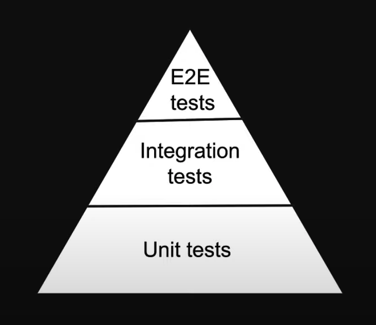

## 2.2 Types of test (3)

### 2.2.1 Unit tests

- Focus on testing individual building blocks of an application such as a class, a function, a component
- Each unit or building block is tested in isolation, independent of other units
- Dependencies are mocked
- Run in a short amount of time and easy to pinpoint failures
- Relatively easier to write and maintain

### 2.2.2 Integration tests

- Focus on testing a combination of units and ensuring they work together
- Take longer than unit tests

### 2.2.3 E2E tests

- Focus on testing the entire application flow and ensuring it works as designed from start to finish
- Involved in a real UI, a real backend database, real services, etc
- Take the longest as they cover the most amount of code
- Have a cost implication as you interact with real APIs that may charge based on the number of requests

## 2.3 What to test?

- Test component renders
- Test component renders with props
- Test component renders with different states
- Test component reacts to event

## 2.4 What not to test?

- Implementation details
- Third party code
- Code that is not important from a user point of view

## 2.5 What is user interactions test?

- A click using a mouse, or a keypress using a keyboard
- Software has to respond to such interactions
- Test should ensure the interactions are handled as expected

## 2.6 Test Driven Development (TDD)

- A software development process where you write tests before writing the software code
- Once the test have been written, you then write the code to ensure the tests pass
  1. Create tests that verify the functionality of a specific feature
  2. Write software code that will run the tests successfully when re-executed
  3. Refactor the code for optimization while ensuring the tests continue to pass
     Also called red-green testing as all tests go from a red failed state to a green passed state

# 3. How to setup?

## 3.1 Install library

> In create-react-app, react-testing-library is installed automatically

## 3.2 Config & Setup

### 3.2.1 package.json

```json
{
  "scripts": {
    "test": "react-scripts test",
    "coverage": "yarn test --coverage --watchAll --collectCoverageFrom='src/components/**/*.{ts,tsx}' --collectCoverageFrom='!src/components/**/*.{types,stories,constants,test,spec}.{ts,tsx}'"
  }
}
```

# 4. React Testing Library (RTL)

## 4.1 Rules & Syntax

> React Testing Library (RTL) strikes a balance between unit and E2E tests which is what we will be learning in the rest of the series

`describe(name, fn)`

- 1st argument is a group name
- 2nd argument is a function that contains the expectations to test

`test(name, fn, timeout)`

- Default timeout to abort test is 5s
- `test.only()`: to run only this test
- `test.skip()`: to skip this test

### 4.1.1 Filename Conventions

- Files with .test.js or .test.tsx suffix
- Files with .spec.js or .spec.tsx suffix
- Files with .js or .tsx suffix in **tests** folders

> Recommendation is to always put your tests next to the code they are testing so that relative imports are shorter
> In test result, 1 file is 1 test suite

### 4.1.2 Code Coverage

- Check [3.2.1 package.json](#321-packagejson)

A metric that can help you understand how much of your software code is tested

- Statement coverage: how many of the statements in the software code have been executed
- Branches coverage: how many of the branches of the control structures (if statements for instance) have been executed
- Function coverage: how many of the functions defined have been called and finally
- Line coverage: how many of lines of source code have been tested

### 4.1.3 Assertion

- [How to use assertion matchers in a right way?](https://jestjs.io/docs/using-matchers)
- [Matchers for Jest DOM](https://github.com/testing-library/jest-dom)

## 4.2 How to test component? (RTL Queries)

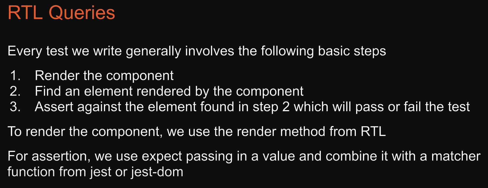
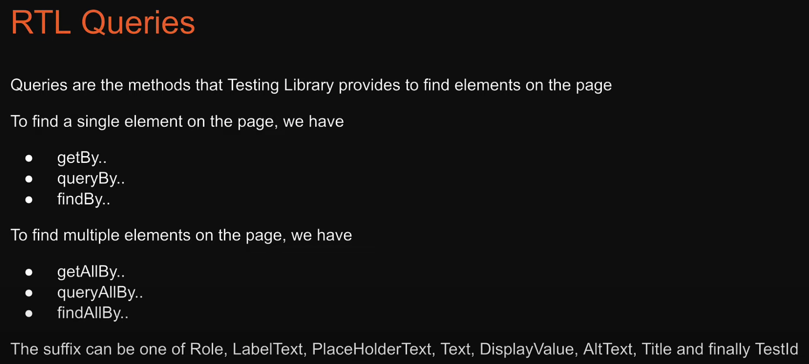

- Use `Testing Playground` extension to select element and get suggested query code

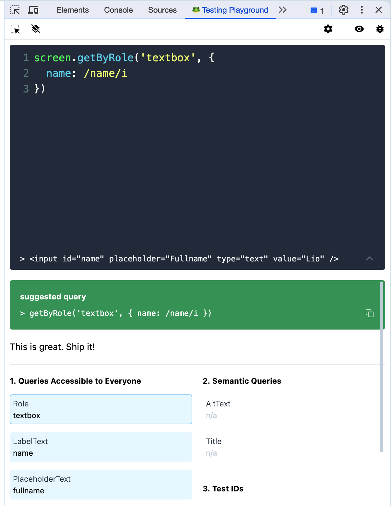

### 4.2.1 Get elements presented in DOM (RTL getBy and getAllBy)

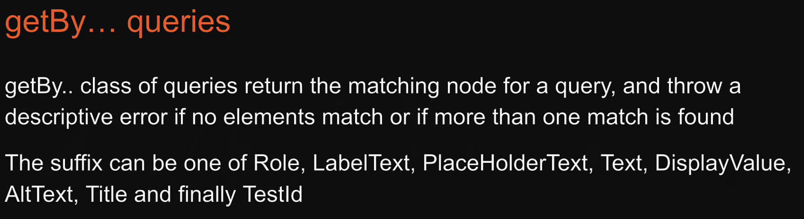

#### Priority order for queries

1. getByRole
2. getByLabelText
3. getByPlaceholderText
4. getByText
5. getByDisplayValue
6. getByAltText
7. getByTitle
8. getByTestId

#### getByRole

- [HTML Aria Document](https://www.w3.org/TR/html-aria/#docconformance)
- [Testing Library | ByRole](https://testing-library.com/docs/queries/byrole)

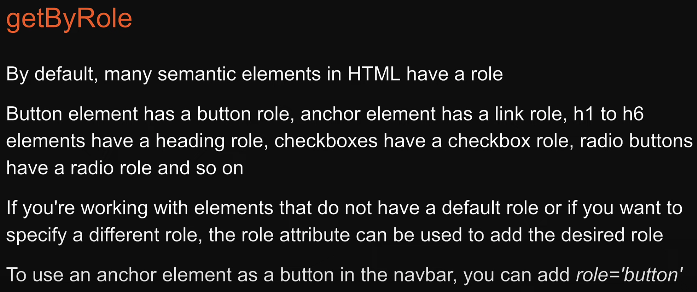

getByRole options: name, level, hidden, selected, checked, pressed

- name: the accessible name is for simple cases equal to
  - Label of form element
  - Text content of a button or heading
  - Value of the aria-label attribute

```js
// react-testing/src/components/application/application.test.tsx

const pageHeading = screen.getByRole('heading', {
  level: 1,
  name: 'Job application form',
})
expect(pageHeading).toBeInTheDocument()

const nameElement = screen.getByRole('textbox', { name: 'Name' })
expect(nameElement).toBeInTheDocument()
```

#### getByLabelText

```js
// react-testing/src/components/application/application.test.tsx

const nameElement1 = screen.getByLabelText('Name', { selector: 'input' })
expect(nameElement1).toBeInTheDocument()

const termsElement1 = screen.getByLabelText(
  'I agree to the terms and conditions',
)
expect(termsElement1).toBeInTheDocument()
```

#### getByPlaceholderText

```js
// react-testing/src/components/application/application.test.tsx

const nameElement3 = screen.getByPlaceholderText('Fullname')
expect(nameElement3).toBeInTheDocument()
```

#### getByText

- [TextMatch | Youtube Tutorial](https://www.youtube.com/watch?v=BD1r5ADfe28&list=PLC3y8-rFHvwirqe1KHFCHJ0RqNuN61SJd&index=29)

```js
// react-testing/src/components/application/application.test.tsx

const paragraphElement = screen.getByText('All fields are mandatory')
expect(paragraphElement).toBeInTheDocument()
```

#### getByDisplayValue

```js
// react-testing/src/components/application/application.test.tsx

const nameElement4 = screen.getByDisplayValue('Lio')
expect(nameElement4).toBeInTheDocument()
```

#### getByAltText

```js
// react-testing/src/components/application/application.test.tsx

const imageElement = screen.getByAltText('a person with a laptop')
expect(imageElement).toBeInTheDocument()
```

#### getByTitle

```js
// react-testing/src/components/application/application.test.tsx

const closeElement = screen.getByTitle('close')
expect(closeElement).toBeInTheDocument()
```

#### getByTestId

```js
// react-testing/src/components/application/application.test.tsx

const customElement = screen.getByTestId('custom-element')
expect(customElement).toBeInTheDocument()
```

#### getAllByRole

```js
// react-testing/src/components/skills/Skills.test.tsx

const listItemElements = screen.getAllByRole('listitem')
expect(listItemElements).toHaveLength(3)
```

### 4.2.2 Get elements not presented in DOM (RTL queryBy and queryAllBy)

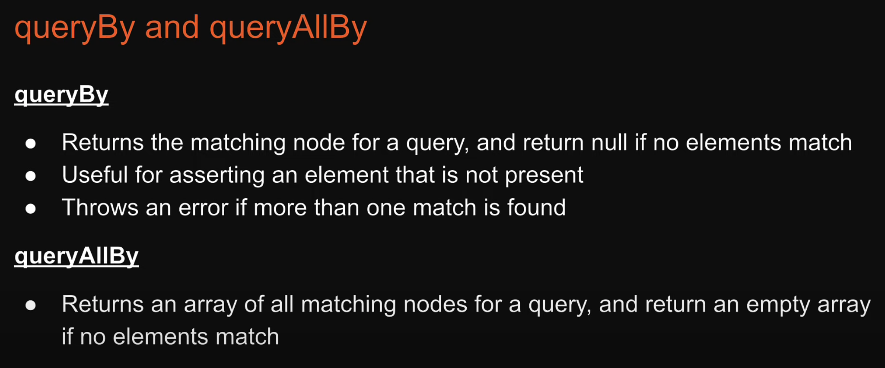
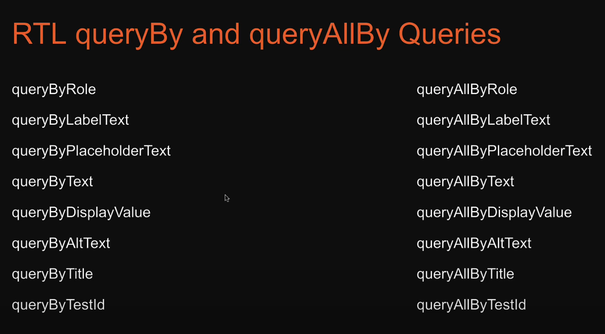

```js
// react-testing/src/components/skills/Skills.test.tsx

test('Start learning button is not rendered', () => {
  render(<Skills skills={skills} />)
  const startLearningButton = screen.queryByRole('button', {
    name: 'Start learning',
  })
  expect(startLearningButton).not.toBeInTheDocument()
})
```

### 4.2.3 Get elements presented in DOM and asynchronous operation (RTL findBy and findAllBy)

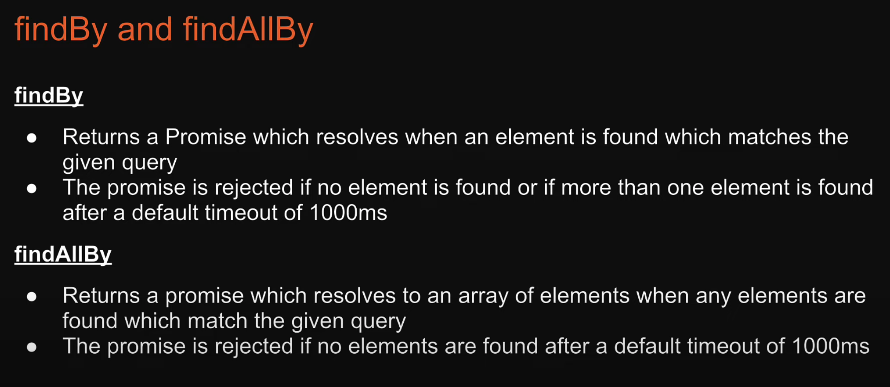

```js
// react-testing/src/components/skills/Skills.test.tsx

test('Start learning button is eventually displayed', async () => {
  render(<Skills skills={skills} />)
  const startLearningButton = await screen.findByRole(
    'button',
    {
      name: 'Start learning',
    },
    {
      timeout: 2000, // by default, timeout is 1000
    },
  )
  expect(startLearningButton).toBeInTheDocument()
})
```

## 4.3 How to test component? (Manual Queries)

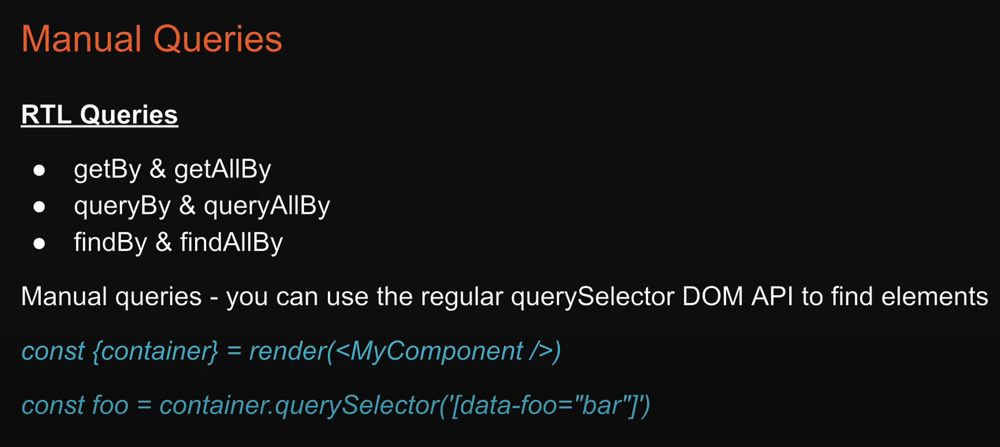

## 4.4 How to debug to get elements?

- Use `logRoles()` method
- Use `screen.debug()` method

```js
// react-testing/src/components/skills/Skills.test.tsx

import { logRoles, render, screen } from '@testing-library/react'

const view = render(<Skills skills={skills} />)

logRoles(view.container)
// screen.debug();
```

## 4.5 How to simulate user interactions?

### 4.5.1 user-event vs fireEvent

> All apis from user-event are asynchronous

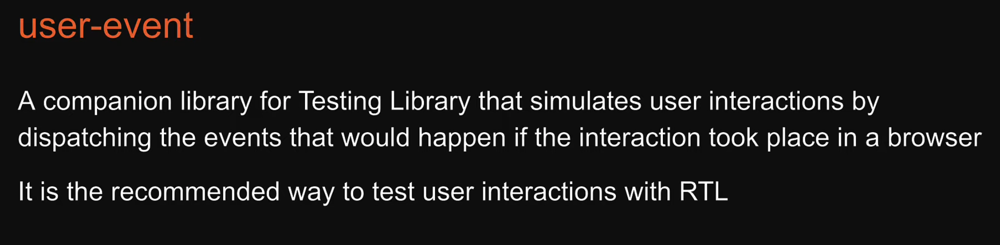
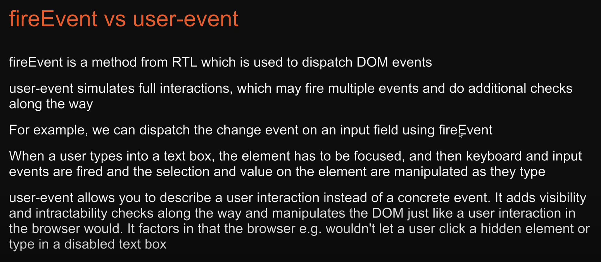

### 4.5.2 Pointer Interactions

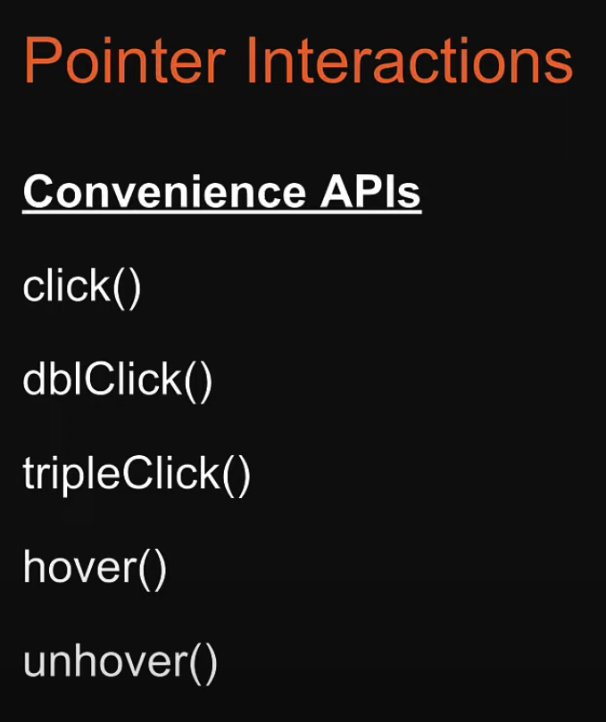
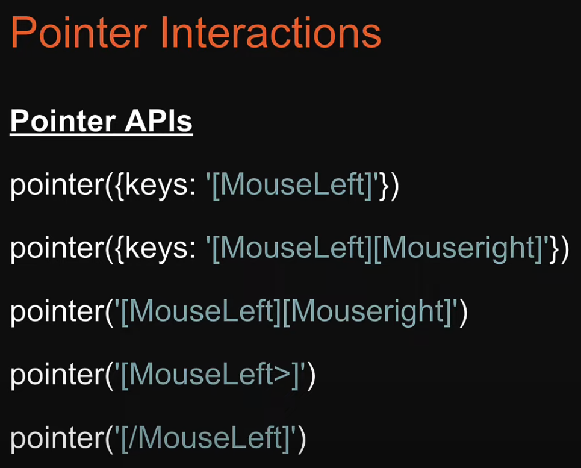

- Run `user.setup()` first before running any user methods
- `user.click()` method

```js
// src/components/counter/Counter.test.tsx

import { act, render, screen } from "@testing-library/react";
import user from "@testing-library/user-event";
import { Counter } from "./Counter";

describe("Counter test suite", () => {
  let countElement: HTMLElement;
  let incrementButton: HTMLElement;

  function setup() {
    user.setup();

    render(<Counter />);

    countElement = screen.getByRole("heading");
    incrementButton = screen.getByRole("button", { name: "Increment" });
  }

  beforeEach(() => {
    setup();
  });

  test("renders a count of 1 after clicking", async () => {
    async function clickButton() {
      await user.click(incrementButton);
    }

    await act(async () => {
      await clickButton();
    });

    expect(countElement).toHaveTextContent("1");
  });

  test("renders a count of 2 after clicking twice", async () => {
    async function clickButton() {
      await user.click(incrementButton);
    }

    let i = 0;
    while (i < 2) {
      await act(async () => {
        await clickButton();
      });
      i++;
    }

    expect(countElement).toHaveTextContent("2");
  });
});
```

### 4.5.3 Keyboard Interactions

[Keyboard Interactions | Youtube Tutorial](https://www.youtube.com/watch?v=kqX14UyjhDM&list=PLC3y8-rFHvwirqe1KHFCHJ0RqNuN61SJd&index=37)

- `user.tab()` method
- `user.type()` method

```js
// src/components/counter/Counter.test.tsx

import { act, render, screen } from "@testing-library/react";
import user from "@testing-library/user-event";
import { Counter } from "./Counter";

describe("Counter test suite", () => {
  let countElement: HTMLElement;
  let incrementButton: HTMLElement;

  function setup() {
    user.setup();
    render(<Counter />);
    countElement = screen.getByRole("heading");
    incrementButton = screen.getByRole("button", { name: "Increment" });
  }

  beforeEach(() => {
    setup();
  });

  test("renders a count of 10 after clicking set button", async () => {
    const amountInput = screen.getByRole("spinbutton");
    const setButton = screen.getByRole("button", { name: "Set" });

    async function typeAmount() {
      await user.type(amountInput, "10");
      await user.click(setButton);
    }

    await act(async () => {
      await typeAmount();
    });

    expect(amountInput).toHaveValue(10);
    expect(countElement).toHaveTextContent("10");
  });

  test("elements are focused in the right order", async () => {
    const amountInput = screen.getByRole("spinbutton");
    const setButton = screen.getByRole("button", { name: "Set" });

    async function clickTab() {
      await user.tab();
    }

    await act(async () => {
      await clickTab();
    });
    expect(incrementButton).toHaveFocus();
  });
});
```

## 4.6 How to test components with providers?

- Create `test-utils.tsx`
- Use methods exported from `test-utils`

```js
// src/test-utils.tsx

import React, { ReactElement } from "react";
import { render, RenderOptions } from "@testing-library/react";
import { AppProviders } from "./providers/AppProviders";

/*
 * This util creates custom render method with all providers wrapped React Element
 */

const AllTheProviders = ({ children }: { children: React.ReactNode }) => {
  return <AppProviders>{children}</AppProviders>;
};

const customRender = (
  ui: ReactElement,
  options?: Omit<RenderOptions, "wrapper">
) => render(ui, { wrapper: AllTheProviders, ...options });

export * from "@testing-library/react";
export { customRender as render };
```

```js
// src/components/mui/MuiMode.test.tsx

import { render, screen } from '../../test-utils'
import { MuiMode } from './MuiMode'

describe('MuiMode test suite', () => {
  test('renders text correctly', () => {
    render(<MuiMode />)
    const headingElement = screen.getByRole('heading')
    expect(headingElement).toHaveTextContent('dark mode')
  })
})
```

## 4.7 How to test hooks?

```js
// src/hooks/use-counter/useCounter.test.tsx

test('should accept and render the same initial count', () => {
  const { result } = renderHook(useCounter, {
    initialProps: {
      initialCount: 10,
    },
  })

  expect(result.current.count).toBe(10)
})

test('should increment count', () => {
  const { result } = renderHook(useCounter)

  act(() => {
    result.current.increment()
  })

  expect(result.current.count).toBe(1)
})
```

## 4.8 How to test function? (Mocking Functions)

- Use `jest.fn()` method

```js
// src/components/counter-two/CounterTwo.test.tsx

import { render, screen } from '@testing-library/react'
import { CounterTwo } from './CounterTwo'
import user from '@testing-library/user-event'

describe('CounterTwo test suite', () => {
  test('handlers are called', async () => {
    const handleDecrementMock = jest.fn()
    const handleIncrementMock = jest.fn()

    render(
      <CounterTwo
        count={0}
        handleDecrement={handleDecrementMock}
        handleIncrement={handleIncrementMock}
      />,
    )
    const decrementButton = screen.getByRole('button', { name: 'Decrement' })
    const incrementButton = screen.getByRole('button', { name: 'Increment' })

    await user.click(decrementButton)
    expect(handleDecrementMock).toHaveBeenCalledTimes(1)

    await user.click(incrementButton)
    expect(handleIncrementMock).toHaveBeenCalledTimes(1)
  })
})
```

## 4.9 How to test API? (Mock Service Worker)

- Check React-Testing-Vite folder
- [How to setup MSW for React Project? (not only Vite)](https://www.mattstobbs.com/msw-2-in-react-vite/)
- [Mock Service Worker | Official Document](https://mswjs.io/docs/getting-started)
- [Migration from 1.x to 2.x | Typescript version](https://mswjs.io/docs/migrations/1.x-to-2.x#typescript-version)

# 5. How to setup Eslint for Jest (create-react-app)?

## 5.1 Install library

- Check [1. Resources](#1-resources)

```bash
npm install --save-dev eslint-plugin-jest-dom
```

## 5.2 Config

### 5.2.1 package.json

```json
{
  "scripts": {
    "test": "react-scripts test",
    "coverage": "yarn test --coverage --watchAll --collectCoverageFrom='src/components/**/*.{ts,tsx}' --collectCoverageFrom='!src/components/**/*.{types,stories,constants,test,spec}.{ts,tsx}'"
  },
  "eslintConfig": {
    "extends": ["react-app", "react-app/jest", "plugin:jest-dom/recommended"]
  }
}
```

# 6. How to setup Prettier?

- Check [1. Resources](#1-resources)

## 6.1 Install library

> `eslint-config-prettier` will help eslint and prettier not conflict

```bash
npm install --save-dev prettier eslint-config-prettier
```

## 6.2 Config

### 6.2.1 package.json

```json
{
  "scripts": {
    "format": "prettier --ignore-path .gitignore --write \"**/*.{ts,tsx,css,scss}\""
  },
  "eslintConfig": {
    "extends": [
      "react-app",
      "react-app/jest",
      "plugin:jest-dom/recommended",
      "eslint-config-prettier"
    ]
  }
}
```

### 6.2.2 .prettierrc.json

```json
{
  "arrowParens": "always",
  "bracketSameLine": false,
  "bracketSpacing": true,
  "semi": false,
  "experimentalTernaries": false,
  "singleQuote": true,
  "jsxSingleQuote": false,
  "quoteProps": "as-needed",
  "trailingComma": "all",
  "singleAttributePerLine": false,
  "htmlWhitespaceSensitivity": "css",
  "vueIndentScriptAndStyle": false,
  "proseWrap": "preserve",
  "insertPragma": false,
  "printWidth": 80,
  "requirePragma": false,
  "tabWidth": 2,
  "useTabs": false,
  "embeddedLanguageFormatting": "auto"
}
```

# 7. How to setup Husky?

- Check [1. Resources](#1-resources)

## 7.1 Install library

```bash
npm i -D husky
```

## 7.2 Config

### 7.2.1 package.json

```json
{
  "scripts": {
    "prepare": "cd ../../ && husky install ./react-testing/create-react-app/.husky"
  }
}
```

### 7.2.2 .husky/pre-commit

```bash
#!/bin/sh
. "$(dirname "$0")/_/husky.sh"

cd ./react-testing/create-react-app && yarn lint && yarn format
```

### 7.2.3 Terminal

```bash
# Create husky.sh file

npm run prepare
```

```bash
# Enable husky and hooks in MacOS (if any)

chmod ug+x .husky/*
chmod ug+x .git/hooks/*
```

# 8. How to setup lint-staged?

- Check [1. Resources](#1-resources)
- Use `lint-staged` combine with `Husky`

## 8.1 Install library

```bash
npm i -D lint-staged
```

## 8.2 Config

### 8.2.1 package.json

```json
{
  "lint-staged": {
    "*.{ts,tsx}": ["eslint"],
    "*.{ts,tsx,css,scss}": ["prettier --write"]
  }
}
```

### 8.2.2 .husky/pre-commit

```bash
#!/bin/sh
. "$(dirname "$0")/_/husky.sh"

# Run eslint & format before committing code
cd ./react-testing/create-react-app && npx lint-staged
```

### 8.2.3 .husky/pre-push

```bash
#!/bin/sh
. "$(dirname "$0")/_/husky.sh"

# Run test to make sure all pass before pushing code
cd ./react-testing/create-react-app && npm test -- --watchAll=false
```

# 9. How to setup Github Action?

## 9.1 .github/workflows/action.yml

```yml
name: Test CI | create-react-app

on:
  push:
    branches: ['react-testing-create-react-app']
  pull_request:
    branches: ['react-testing-create-react-app']

jobs:
  build:
    runs-on: ubuntu-latest

    strategy:
      matrix:
        node-version: [20.x]
        # See supported Node.js release schedule at https://nodejs.org/en/about/releases/

    steps:
      - uses: actions/checkout@v3
      - name: Use Node.js ${{ matrix.node-version }}
        uses: actions/setup-node@v3
        with:
          node-version: ${{ matrix.node-version }}
          cache: 'npm'
      - run: npm ci
      - run: npm run lint
      - run: npm run test
```
